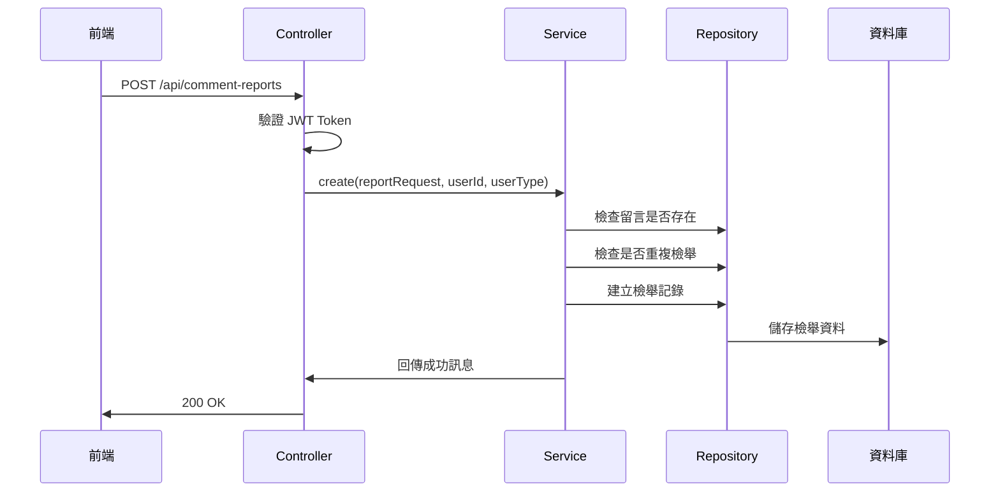
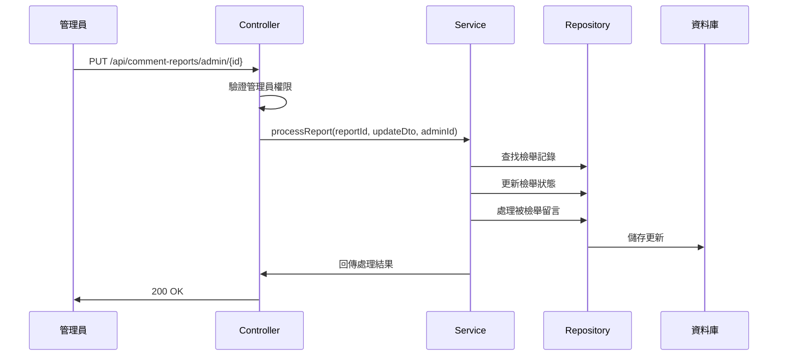

# 檢舉功能系統報告

## 📋 目錄
1. [系統概覽](#系統概覽)
2. [技術架構](#技術架構)
3. [API 端點分析](#api-端點分析)
4. [身分驗證機制](#身分驗證機制)
5. [資料流程](#資料流程)
6. [權限控制](#權限控制)
7. [資料庫設計](#資料庫設計)
8. [安全性分析](#安全性分析)
9. [測試狀況](#測試狀況)
10. [建議改進](#建議改進)

---

## 系統概覽

### 功能描述
檢舉功能允許用戶對不當留言進行檢舉，管理員可以審核並處理這些檢舉。系統支援多種檢舉原因，並提供完整的檢舉生命週期管理。

### 核心功能
- ✅ 用戶提交檢舉
- ✅ 管理員查詢檢舉列表
- ✅ 管理員處理檢舉（確認/駁回）
- ✅ 檢舉狀態追蹤
- ✅ 多種檢舉原因支援
- ✅ 防止重複檢舉

---

## 技術架構

### 後端技術棧
- **框架**: Spring Boot 3.x
- **資料庫**: SQL Server
- **認證**: JWT (JSON Web Token)
- **API 風格**: RESTful
- **交易管理**: Spring Transaction

### 核心組件
```
journey.controller.comments.CommentReportsController
├── 檢舉提交 API
├── 管理員查詢 API
└── 管理員處理 API

journey.service.comments.CommentReportsService
├── 檢舉業務邏輯
├── 權限驗證
└── 資料處理

journey.repository.comments.CommentReportsRepository
└── 資料庫操作
```

---

## API 端點分析

### 1. 管理員查詢端點
```http
GET /api/comment-reports/admin?status=PENDING&page=0&size=20
Authorization: Bearer <JWT_TOKEN>
```
[
    {
        "reportId": 1,
        "status": "PENDING",
        "statusLabel": "待處理",
        "createdAt": "2025-07-11T20:34:26.317",
        "reviewedAt": null,
        "note": null,
        "reasonId": 1,
        "reasonText": "色情內容",
        "reporter": {
            "id": 3,
            "username": "vendor",
            "avatarUrl": null
        },
        "reportedComment": {
            "id": 13,
            "userName": null,
            "content": "系統範例留言 #11：住宿體驗超棒！",
            "rating": 3,
            "createdAt": "2025-06-30T20:31:26.867",
            "parentCommentId": null,
            "isActive": true,
            "deleteStatus": 1,
            "statusMessage": null,
            "author": {
                "id": 1,
                "username": "user",
                "avatarUrl": null
            },
            "images": null,
            "canEdit": true,
            "canDelete": true,
            "canReport": true,
            "canLike": true,
            "likedByCurrentUser": false,
            "likeCount": 0,
            "replies": null,
            "editable": false,
            "replyable": false,
            "reportable": false
        },
        "reviewer": null
    }
]

**功能**: 管理員查詢檢舉列表
**權限**: 僅管理員可存取
**參數**:
- `status`: 檢舉狀態篩選 (PENDING/RESOLVED/REJECTED)
- `page`: 頁碼 (預設 0)
- `size`: 每頁大小 (預設 20)

### 3. 管理員處理端點
```http
PUT /api/comment-reports/admin/{reportId}
Authorization: Bearer <JWT_TOKEN>
Content-Type: application/json

{
  "status": "RESOLVED",
  "note": "檢舉成立，已刪除留言"
}
```

**功能**: 管理員處理檢舉
**權限**: 僅管理員可存取
**狀態值**: RESOLVED, REJECTED

### 3. 檢舉提交端點
```http
POST /api/comment-reports
Authorization: Bearer <JWT_TOKEN>
Content-Type: application/json

{
  "commentId": 123,
  "reasonIds": [1, 2]
}
```

**功能**: 用戶提交檢舉
**權限**: 需要登入，管理員不能檢舉
**驗證**: JWT token 驗證

---

## 身分驗證機制

### JWT Token 驗證流程
```java
// 1. 提取 Token
String token = JwtUtil.extractToken(authHeader);

// 2. 驗證 Token
JwtDTO jwt = JwtUtil.verfiy(token);

// 3. 權限檢查
if (jwt.getUserType() != UserTypeEnum.ADMIN) {
    return ResponseEntity.status(HttpStatus.FORBIDDEN)
            .body("權限不足");
}
```

### 驗證特點
- ✅ 使用 RSA256 演算法簽名
- ✅ Token 有效期 7 天
- ✅ 包含用戶 ID、用戶名、電子郵件、用戶類型
- ✅ 自動驗證簽名和過期時間

---

## 資料流程

### 檢舉提交流程


### 管理員處理流程


---

## 權限控制

### 用戶權限矩陣
| 操作 | USER | ADMIN | VENDOR |
|------|------|-------|--------|
| 提交檢舉     | ✅ | ❌ | ✅ |
| 查詢檢舉列表 | ❌ | ✅ | ❌ |
| 處理檢舉     | ❌ | ✅ | ❌ |
| 檢舉自己留言 | ❌ | ❌ | ❌ |

### 權限驗證邏輯
```java
// 檢舉提交權限檢查
if (jwt.getUserType() == UserTypeEnum.ADMIN) {
    throw new AccessDeniedException("管理員不能檢舉留言");
}

// 管理員操作權限檢查
if (jwt.getUserType() != UserTypeEnum.ADMIN) {
    return ResponseEntity.status(HttpStatus.FORBIDDEN)
            .body("權限不足: 只有管理員可以處理檢舉");
}
```

---

## 資料庫設計

### 核心資料表
```sql
-- 檢舉記錄表
CREATE TABLE comment_reports (
    id INT PRIMARY KEY IDENTITY(1,1),
    comment_id INT NOT NULL,
    reason_id INT NOT NULL,
    created_by INT NOT NULL,
    reviewed_by INT NULL,
    status VARCHAR(20) DEFAULT 'PENDING',
    note TEXT NULL,
    created_at DATETIME2 DEFAULT GETDATE(),
    reviewed_at DATETIME2 NULL
);

-- 檢舉原因表
CREATE TABLE comment_reasons (
    id INT PRIMARY KEY IDENTITY(1,1),
    reason_name NVARCHAR(100) NOT NULL,
    description TEXT NULL
);
```

### 關聯關係
- `comment_reports.comment_id` → `comments.id`
- `comment_reports.reason_id` → `comment_reasons.id`
- `comment_reports.created_by` → `all_users.id`
- `comment_reports.reviewed_by` → `admins.id`

---

## 安全性分析

### 已實作的安全措施
✅ **JWT Token 驗證**
- RSA256 演算法簽名
- Token 過期檢查
- 簽名驗證

✅ **權限控制**
- 角色基礎存取控制 (RBAC)
- 管理員專用端點保護
- 防止管理員檢舉留言

✅ **業務邏輯驗證**
- 防止重複檢舉
- 防止檢舉自己留言
- 檢舉狀態驗證

### 潛在安全風險
⚠️ **SQL 注入防護**
- 使用 JPA Repository，自動防護
- 建議定期安全審查

⚠️ **Rate Limiting**
- 建議實作 API 呼叫頻率限制
- 防止惡意大量檢舉

---

## 測試狀況

### 已實作的測試
- ✅ JWT Token 生成和驗證測試
- ✅ 檢舉提交功能測試
- ✅ 管理員權限驗證測試

### 建議測試項目
- [ ] 檢舉重複提交測試
- [ ] 檢舉自己留言測試
- [ ] 管理員處理檢舉測試
- [ ] 檢舉狀態變更測試
- [ ] 大量檢舉效能測試

---

## 建議改進

### 短期改進 (1-2 週)
1. **加入檢舉通知機制**
   - 檢舉提交成功通知
   - 管理員處理結果通知

2. **優化查詢效能**
   - 加入適當的資料庫索引
   - 實作分頁快取

3. **實作 Rate Limiting**
   - 限制檢舉提交頻率
   - 防止惡意大量檢舉

### 中期改進 (1-2 個月)
1. **檢舉統計功能**
   - 檢舉趨勢分析
   - 熱門檢舉原因統計

2. **自動化處理**
   - 自動檢舉過濾
   - 智能檢舉分類

3. **檢舉歷史追蹤**
   - 檢舉處理歷史記錄
   - 管理員操作日誌

### 長期改進 (3-6 個月)
1. **機器學習整合**
   - 自動檢舉分類
   - 檢舉風險評估

2. **多語言支援**
   - 檢舉原因多語言
   - 系統訊息國際化

3. **API 版本控制**
   - 實作 API 版本管理
   - 向後相容性保證

---

## 結論

檢舉功能已具備完整的基礎架構，包含：
- ✅ 完整的 JWT 身分驗證
- ✅ 嚴格的權限控制
- ✅ 完整的業務邏輯驗證
- ✅ 清晰的 API 設計

主要需要改進的項目：
- ⚠️ 加入通知機制
- ⚠️ 優化查詢效能
- ⚠️ 實作 Rate Limiting
- ⚠️ 增加自動化處理功能

整體而言，檢舉功能已達到生產環境可用的標準，建議在解決安全性問題後即可部署使用。 